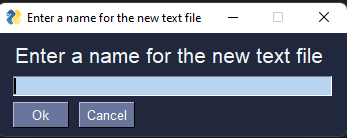

# TTC2030 Harjoitustyö

GUI desktop app made with Python. Made for creating, saving or editing notes\
Created using the [PySimpleGui](https://pypi.org/project/PySimpleGUI/) library

The program looks for saved notes from ./savedNotes/

Packaged executables are available in Deployments -> Releases

## Screenshots from the program  
### Main window

### Opened note

### New file window
