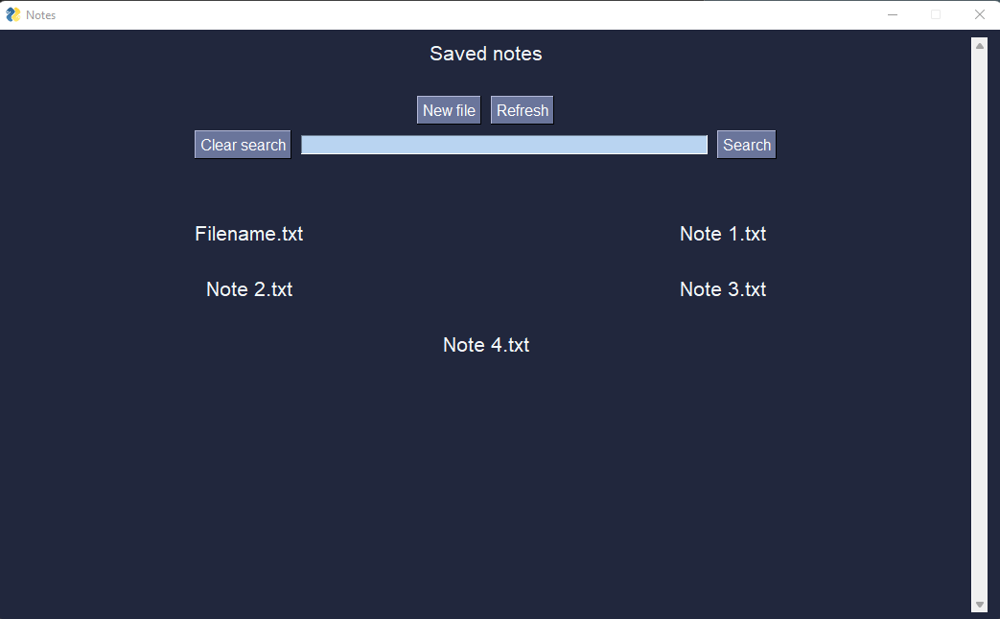

# Python text editor

GUI desktop app made with Python. Made for creating, saving or editing text files\
Created using the [PySimpleGui](https://pypi.org/project/PySimpleGUI/) library

Default save location for files is ./savedFiles but you can change it from the GUI.

Packaged executables for Windows and Linux are available in Releases

## Screenshots from the program  
###

### Main window

### Opened note

### New file window
